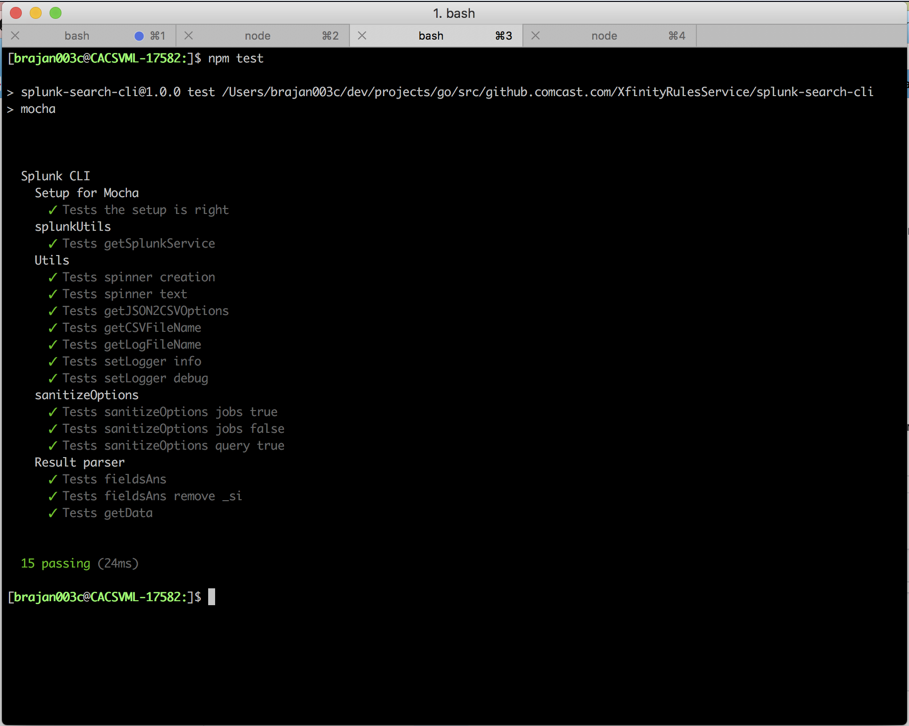

# splunk-search-cli
A simple command line interface to search splunk and display results in STDOUT CSV format. It is written in Node js. 

# Requirements
Requirments file present in [here](docs/Splunk%20search%20CLI.pdf)

## To Run
Please follow the below steps for setting up the CLI

- Clone this repo into local machine
- `cd splunk-search-cli`
- `npm i`
- `npm start`

Once the command line interface opens you will see the following screen


## Commands

### help
Once the application is started with the above instructions `help` command will display all the available commands and its functionalities
```
splunk-search-cli$ help

  Commands:

    help [command...]       Provides help for a given command.
    exit                    Exits application.
    clear                   clears the screen
    search [options]        Queries splunk prints the results. Saves results to ./results-csv/ dir
    searchasync [options]   Asynchronously. queries splunk prints the results. Does NOT save results in file

splunk-search-cli$
```
------

### clear
`clear` command clears the screen 

```
splunk-search-cli$ help clear

  Usage: clear [options]

  clears the screen

  Options:

    --help  output usage information

splunk-search-cli$
```
------

### search 
- `search` command does a one shot search on the splunk server and prints the output at STDOUT in CSV format. 
- It fetches first 100 results
- It saves the results in the saves results to `./results-csv/` directory. 
- It saves the logs under `./debug-logs/` directory. Default log level is `info`. 
- This command can be executed in debug mode using the argument `-d` or `--debug` upon which this the log level will be set to debug 
- As this command fetches first 100 results, it is not recommended for larger search results. 

Please find the options and their descriptions below
```
splunk-search-cli$ help search

  Usage: search [options]

  Queries splunk prints the results. Saves results to ./results-csv/ dir

  Options:

    --help                     output usage information
    -d, --debug                Debug boolean. Sets log level to debug. Log files @ ./debug-logs/ dir
    -u, --username <username>  Splunk username.
    -p, --password <password>  Splunk password.
    -h, --host <host>          Splunk REST API URL.
    --port <port>              Splunk REST API port.
    --query                    Splunk search query

splunk-search-cli$
```
------

### searchasync
- `searchasync` command does asynchronously search on the splunk server and prints the output at STDOUT in CSV format. 
- It fetches all results 
- It does NOT save the results in the saves results to `./results-csv/` directory. 
- It saves the logs under `./debug-logs/` directory. Default log level is `info`. 
- This command can be executed in debug mode using the argument `-d` or `--debug` upon which this the log level will be set to debug 
- As this command fetches all the results, it is recommended for larger search results. 

Please find the options and their descriptions below
```
splunk-search-cli$ help searchasync

  Usage: searchasync [options]

  Asynchronously queries splunk prints the results. Does NOT save results in file

  Options:

    --help                     output usage information
    -d, --debug                Debug boolean. Sets log level to debug. Log files @ ./debug-logs/ dir
    -u, --username <username>  Splunk username.
    -p, --password <password>  Splunk password.
    -h, --host <host>          Splunk REST API URL.
    --port <port>              Splunk REST API port.
    --query                    Splunk search query

splunk-search-cli$
```
## DEMO Queries
Below is the command that returns the list of web pages that have been indexed by Google (“Googlebot”).
```
search -u admin --password P@ssw0rd -h localhost --port 8089 --query "sourcetype=access_* useragent=*google* AND useragent=*Bot* | dedup file | table uri_path file | rename file as File | rename uri_path AS Webpages" -d
```


Below command generates a list of usernames that were used in failed SSH login attempts from 27.0.0.0/8
```
search -u admin -p P@ssw0rd -h localhost --port 8089 --query "ssh* error OR *fail* OR severe |rex field=_raw "(?<val_ignore_1>.*)\ for (?<raw_user>.*)\ from (?<IP>.*)\ port (?<val_ignore_2>.*)" | rex field=IP "27\.0\.0\.(?<range>\d{1,3})" | where range >=0 AND range<=8 | eval User=replace(raw_user, "invalid user ", "") | table User IP" -d
```

Below command generates a table consisting of [Timestamp, Client IP, URL] where the HTTP Server’s response was a 50X error code.
```
search -u admin -p P@ssw0rd -h localhost --port 8089 --query "sourcetype=access* status=50*| table req_time clientip uri_domain uri | rename req_time as Timestamp, uri AS URI, uri_domain AS Domain, clientip AS "Client IP"" -d
```

Note : This command compraises of arguments pertaining to the splunk instance setup in my localmachine which has REST API opened at 8089. 

## Logs
- Uses nodejs + winston for logging 
- Log files are stored under `./debug-logs` directory. 
- Default log level is `info` and `-d` flag make the log level to `debug`
- Files have time stamps in log entires and timestamp as thier filename
- All command line arguments will be logged and password argument is logged as `*********` for security reasons 

## Tests
Unit tests are written in MochaJS. Below are the results for the test run. Unit tests can be run using `npm test` command



## Version Dependencies
- nodejs : v7.10.0 (or newer)
- npm : 5.6.0 (or newer)
